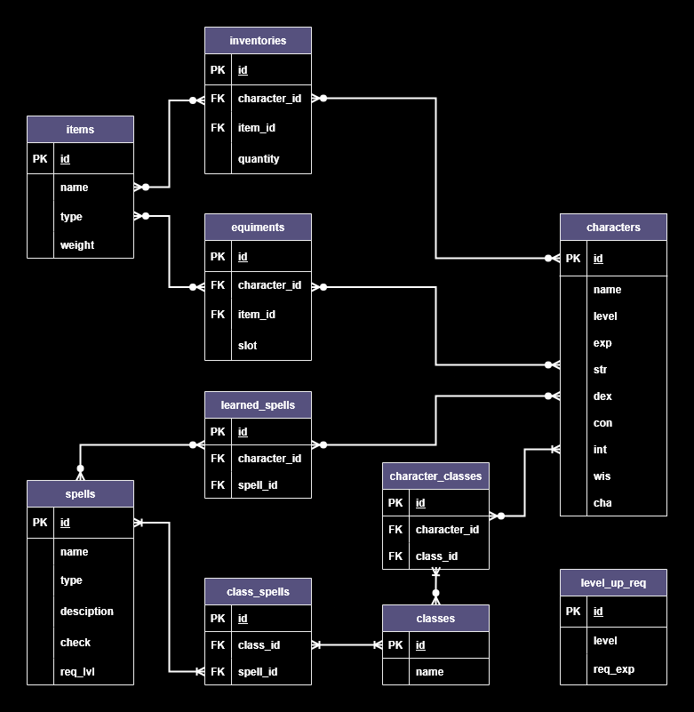

# Design Document

By Phan The Bao

Video overview: <URL [HERE](https://youtu.be/jguOQotWv_A)>

## Scope

This database is designed to help Dungeon Master and players keep track of characters that are participating in a "Dungeon and Dragon" (DnD) campaign.

The database includes:
* **Characters** participate in the campaign and their basic identification, level, ability scores, invetories and equipments.
* **Level up requirements** stores the amount of experience a character need to reach certain level.
* **Classes** that are available according to the standard rules.
* **Spells** that are available according to standard rules, including their type, description, required level to use and which type of ability score that affect them.
* **Items** that can be found, used or equiped, including their type and weight.

Information regarding other campaign-specific participants, such as non-playable characters (NPCs), monsters, bosses,... is out of scope.

## Functional Requirements

Users should be able to keep track of their character's level, abilities score, inventory and equipments, as well as their available spells.

This database is character specific information, detailed information on weapon's damage, spells's damage type, status effect,... is not included.

## Representation

### Entities

The database includes the followinng entities

#### Characters

The `characters` table includes:

* `id`, primarily identify for each character as an `INTERGER`, thus has the `PRIMARY KEY` constraint.
* `name`, represent the character's name as unique `TEXT`.
* `level`, specifies each character's level as an `INT` and has `1` as the default value.
* `exp`, specifies how much experience point each character has gained as an `INT`, start as `0` by default.
* `str`, `dex`, `con`, `int`, `wis`, `cha` specifies the ability score of each character regarding these abilities as an `INT` with the maximum value of 20 according to the DnD rules book.

Every column is required, thus all column has `NOT NULL` contraints.

#### Level up requirement

The `level_up_req` table includes:

* `id`, the unique identifier for each threshold as an `INT`, thus has the `PRIMARY KEY` contraint.
* `level`, specifies every attainable level as an unique `INT` between 1 and 20 inclusively.
* `req_exp`, specifies the amount of experience needed to level up to said level as an `INT`.

#### Classes

The `classes` table includes:
* `id`, an `INt` to uniquely identify each available class with `PRIMARY KEY` contraints.
* `name`, describing each class's name as a unique `TEXT` that can not be `NULL`.

#### Items

The `items` table includes:

* `id`, an `INt` to uniquely identify each available item with `PRIMARY KEY` contraints.
* `name`, specifies each item's name as a unique `TEXT` that can not be `NULL`.
* `type`, specifies the item type as a `TEXT`.
* `weight`, specifies each item's weight as an `INT`.

Every column is required, thus all column has `NOT NULL` contraints.

#### Spells

The `spells` table includes:

* `id`, uniquely identifies each spell using an `INT`.
* `name`, specifies each spell's name as a unique `TEXT` that can not be `NULL`.
* `type`, specifies the type of spell as a `TEXT`.
* `description`, describes the spell in details as a `TEXT`.
* `check`, specifies the type of "check" required to cast/use this spell as a `TEXT`. Simplified down to only 6 types of check, identical to 6 types of ability score each character has.
* `req_lvl`, specifies the required level to cast/use this spell as an `INT`, with the default value similar to the default level of 1.

Every column is required, thus all column has `NOT NULL` contraints.

#### Inventories

The `inventories` table includes:

* `id`, specifies each character - item relationship as an `INT`, thus has `PRIMARY KEY` contraint.
* `character_id`, references existing character's id possesing this item as an `INT`, thus has `FOREIGN KEY` constraint and connects to `characters` table.
* `item_id`, references item's id as an `INT`, thus has `FOREIGN KEY` contraint and connects to the `items` table.
* `quantity`, specifies the quantity of said item in said character's inventory as an `INT`. The default value is set to 1.

Every column is required, thus all column has `NOT NULL` contraints.

#### Equipments

The `equipments` table includes:

* `id`, specifies each character - equipped item relationship as an `INT`, thus has `PRIMARY KEY` constraint.
* `character_id`, references existing character's id equipping this item as an `INT`, thus has `FOREIGN KEY` constraint and connects to `characters` table.
* `item_id`, references item's id as an `INT`, thus has `FOREIGN KEY` contraint and connects to the `items` table.
* `slot`, specifies which slot said item is equipped to as a `TEXT`, limited to:
helmet, shoulders, cape/back, torso, belt, greaves, boots, gloves, ring_1, ring_2, necklace, trinket_1, trinket_2, weapon_1, weapon_2. Triggers are implemented to ensure player cannot equip item outside of their inventory, equipping item to inappropriate slot or to a slot that already has an item in.

Every column is required, thus all column has `NOT NULL` contraints.

### Relationships

#### Character - Item relationship

There are 2 character-item relationships: inventories and equipments. Both have similarities such as an item can appear in more than 1 inventories/equiments, but an item doesn't have to be in anyone inventories/equiments since they might not be found yet or was discarded. Both also related to each other from gameplay perspective. Player cannot equip item that are not in their inventory, cannot equip item with inappropriate type into specific slot, nor they can equip more item into the same slot. These constraint/relationship are implemented through 3 triggers:
* `check_inventory_existence`
* `check_item_type_match_equip_slot`
* `prevent_invalid_equip`

#### Character - Class relationship

DnD allows multiclass set up, which means one character can be in more than 1 class. 1 character must have a class to be functional, but 1 class might not be played by any player. This relationship is established through `character_classes` table.

#### Class - Spell relationship

As featured on the diagram, classes will have their own set of spells. 1 spell can be used by more than 1 class, and there is no spell that not bound to any class. As such, both of them has one to many relationship to each other. This relationship is established through `class_spells` table.

#### Character - Spell relationship

Character has access to a very limited amount of spell at the beginning of the game, and will need to learn them as they progress further into the game. Some character can even choose to start with no spell at all, thus resulted in a zero to many relationship between characters and spells. This relationship is established through the `learned_spells` table. There is an implemented trigger to prohibit character from learning spell that are not within their class's available spells, `check_spell_in_class`. Another trigger also prevent character from learning spell that require higher level than said character, `check_spell_req_level`.

## Optimizations

As shown through common queries, `spells`, `items` and `inventories` would be frequently used to access available spells and items. These tables are also much larger in size compared to other tables, so indexing them should speed up most essential queries.

## Limitations

This database is limited to essential information only and does not include the entire data of a campaign, which can be a lot to keeping track considered the complexity of DnD such as modifiers and damage.

The connection between ability scores and the `check` from the `spells` table might hinder some queries, since ability score is present horizontally (as individual column for each abilities) while the `check` is present vertically (every `spells` has a `check` on one column).
